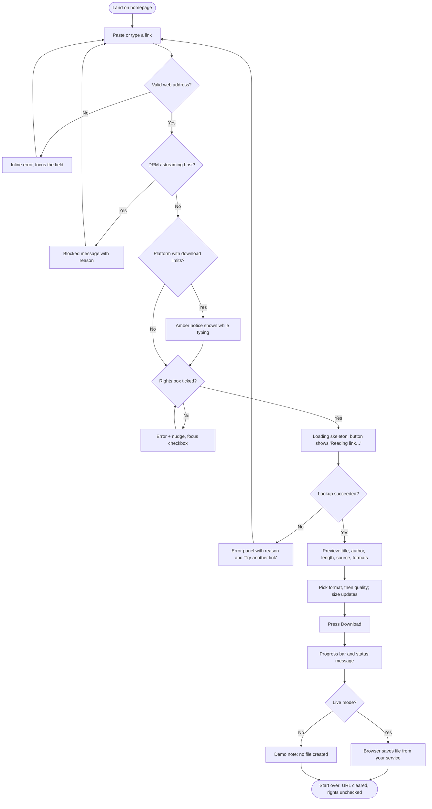

# Sdab: Product Requirements, Compliance, SEO & Conversion

Covers deliverables **1 (PRD)**, **3 (Sitemap)**, **4 (User flow)**, **13 (SEO strategy)**, **14 (Conversion recommendations)**, plus the compliance framework the brief requires.

---

## 1. Product Requirements Document

### 1.1 Summary

| | |
|---|---|
| **Product** | Sdab, a web tool for saving media files the user has the right to keep |
| **One-line pitch** | Paste a link, choose a format, download. Fast, free, no account, and built around copyright and platform rules. |
| **Positioning** | The trustworthy alternative to ad-heavy converter sites. Simplicity of Y2Mate; visual quality, transparency, and rights-awareness of a modern SaaS product. |
| **Platform** | Static site on GitHub Pages (HTML5, Tailwind CSS, vanilla JS). A separate processing service is required for real downloads (see §1.9). |
| **Status of this repo** | Complete front-end, running in **demo mode** (sample data, no files produced). |

### 1.2 Goals and non-goals

**Goals**

1. Get a person with a legitimate need from landing to a downloaded file in under 30 seconds, with no account.
2. Make rights and permission part of the interaction, not fine print.
3. Look and feel like a premium product: credible, fast, calm.
4. Score 95+ on Lighthouse (Performance, Accessibility, Best Practices, SEO) on a real deployment.

**Non-goals**

- Circumventing DRM, paywalls, logins, or any technical protection measure.
- Supporting subscription streaming services.
- Bulk or automated downloading, playlists, or an API for third parties (v1).
- User accounts, history, or cloud storage.

### 1.3 Audiences

| Persona | Need | What Sdab must do |
|---|---|---|
| **Creator** (Maya, 29) | Re-download her own uploads after losing the originals | Accept her link, show her file details, offer the original-quality file |
| **Educator / researcher** (Daniel, 41) | Save Creative Commons and public-domain footage for class | Explain licences, show source and duration, produce clean MP4/MP3 |
| **Archivist / nonprofit** (Priya, 35) | Preserve openly licensed material offline | Reliable formats, clear file sizes, no clutter |
| **Rights holder** (Sam, legal) | Report content processed without permission | Find a takedown path in two clicks and get a response |

### 1.4 Key user stories

| ID | As a… | I want to… | So that… | Acceptance criteria |
|---|---|---|---|---|
| US-1 | user | paste a link and see a preview | I know it's the right file before I download | Title, author, duration, source, thumbnail area, formats and estimated size appear; loading skeleton shown while waiting |
| US-2 | user | choose format and quality | the file fits my device and storage | Format changes update the available qualities and size estimate; native radio inputs, keyboard operable |
| US-3 | user | be reminded of my responsibilities | I don't infringe by accident | Download can't start without the rights confirmation; confirmation resets for every new link |
| US-4 | user | get clear errors | I can fix a bad link myself | Empty, malformed, unsupported, and blocked links each have a specific message; focus moves to the field at fault |
| US-5 | mobile user | do all of this one-handed | I can use it anywhere | Touch targets ≥ 44px on primary controls, no horizontal scroll at 320px, paste button |
| US-6 | rights holder | find how to report infringement | I can protect my work | Copyright page linked from footer, contact section, FAQ, and the responsible-use section |
| US-7 | user with accessibility needs | use the site with a keyboard and screen reader | I'm not excluded | Skip link, visible focus, landmark structure, `aria-live` status/error regions, reduced-motion support |

### 1.5 Functional requirements

| ID | Requirement | Priority | Status |
|---|---|---|---|
| FR-01 | URL input with paste-from-clipboard button | Must | ✅ Built |
| FR-02 | Client-side URL validation (empty, spaces, scheme, credentials, localhost/IP, length) with inline errors | Must | ✅ |
| FR-03 | Rights confirmation checkbox required before every lookup; unchecked on reset | Must | ✅ |
| FR-04 | Blocklist for DRM/streaming hosts (hard stop) | Must | ✅ |
| FR-05 | Notice for platforms whose terms restrict downloads | Must | ✅ |
| FR-06 | Preview states: empty, loading (skeleton), ready, error | Must | ✅ |
| FR-07 | Format + quality selection with size estimate | Must | ✅ |
| FR-08 | Download action with progress and status messaging | Must | ✅ (demo simulates; live mode navigates to your download endpoint) |
| FR-09 | Light/dark theme, follows system, remembered | Should | ✅ |
| FR-10 | Responsive navigation with mobile menu | Must | ✅ |
| FR-11 | FAQ accordion | Should | ✅ Native `<details>` |
| FR-12 | Legal pages: Privacy, Terms, Copyright/takedown | Must | ✅ Templates. **Needs lawyer review** |
| FR-13 | SEO: semantic HTML, OG, Twitter Cards, JSON-LD, sitemap, robots | Must | ✅ |
| FR-14 | Processing backend (metadata + file delivery) | Must for launch | ⛔ Not included; see §1.9 |
| FR-15 | Privacy-friendly analytics and funnel events | Should | ⛔ Recommended, not included |

### 1.6 Non-functional requirements

| Area | Requirement | Where it stands |
|---|---|---|
| Performance | LCP < 2.0 s on mid-range mobile / 4G; CLS < 0.05; TBT < 100 ms | Payload is small (see §1.10). **Verify on the deployed URL.** |
| Accessibility | WCAG 2.2 AA | Contrast, focus, labels, landmarks and motion preferences are designed for it. Run axe/Lighthouse and a screen-reader pass before launch. |
| Browser support | Last 2 versions of Chrome, Edge, Safari, Firefox; iOS Safari 15.4+ | Uses `<details>`, CSS `inset`, `text-wrap: balance` (progressive), `backdrop-filter` (with solid fallback tints) |
| Privacy | No third-party requests on load; no ad or tracking cookies | Fonts self-hosted; only `localStorage` for theme |
| Security | HTTPS only; no `innerHTML` with remote data; untrusted metadata rendered via `textContent` | ✅ |
| Maintainability | No framework; one CSS build step; tokens in one config | ✅ |

### 1.7 Success metrics (targets to set once analytics exist)

| Funnel step | Metric | Initial target |
|---|---|---|
| Land → focus input | Engagement rate | > 60% |
| Focus → valid submit | Submit rate | > 45% |
| Submit → preview shown | Lookup success | > 85% |
| Preview → download started | Completion | > 70% |
| Any | Rights-checkbox friction (submits blocked by missing confirmation) | < 15% and falling |
| Any | Takedown notices received vs. actioned | 100% actioned within your stated SLA |

These are planning targets, not benchmarks. Adjust after two weeks of real data.

### 1.8 Risks

| Risk | Likelihood | Impact | Mitigation |
|---|---|---|---|
| Platform terms or copyright claims against the service | High if scope drifts | Severe | Compliance framework (§2): restricted sources, rights attestation, takedown process, legal review |
| GitHub removes the repo or Pages site under its Acceptable Use / DMCA policies | Medium | Severe | Keep the product within §2. Keep the backend and repo separate. Have a portable static build so you can move hosts. |
| Invented stats or unverifiable claims erode trust | Medium | Medium | Stats are labelled as samples; replace or remove before launch |
| Lighthouse target missed after adding analytics or a CMP | Medium | Low | Performance budget in §1.10 |
| Abuse of the backend (scraping, bulk use) | High once live | Medium | Rate limits, allowlist, no caching of files, abuse monitoring |

### 1.9 Architecture constraint: GitHub Pages is static

GitHub Pages serves files only. It cannot run server code, so **this site cannot itself read a media URL or produce a file.** Everything a browser can do alone is done here (validation, UI, states); the rest needs a service you operate.

```
Browser (GitHub Pages)  ──GET /v1/inspect?url=…──▶  Your processing service
                        ◀── metadata JSON ────────   (allowlisted sources only)
                        ──GET /v1/download?…──────▶
                        ◀── file (attachment) ────
```

The front-end contract is implemented in `assets/js/main.js` (`liveLookup`, download handler) and documented in the README. **No extraction or scraping code is included in this project.** Whoever builds the service is responsible for its legality and for the source restrictions in §2.3.

### 1.10 Performance budget and current payload

| Asset | Budget (gzip) | Current |
|---|---|---|
| HTML | 20 KB | 12.6 KB |
| CSS | 15 KB | 8.8 KB |
| JS | 20 KB | 7.8 KB |
| Fonts | 80 KB | 64 KB (Inter variable + Poppins 600/700, latin subset; only Inter and Poppins 600 preloaded) |
| Images above the fold | 0 | 0 (hero illustration is inline SVG/CSS) |
| Third-party requests | 0 | 0 |

Initial load is roughly 85 KB. No JavaScript is required to read the page.

---

## 2. Compliance framework

> This is a design and product framework, not legal advice. Copyright, DMCA/safe-harbour eligibility, platform terms and consumer law vary by country. Have qualified counsel review the product, the legal pages, and the backend before launch.

### 2.1 Principles

1. **Permission first.** The product is for content the user owns, has permission to use, or that is public-domain or openly licensed.
2. **Attest every time.** Rights confirmation is per link, not per session.
3. **Respect technical protection.** No DRM circumvention, ever.
4. **Respect platform terms.** Many platforms allow downloads only through their own features. The UI says so and the backend enforces source rules.
5. **Act on notices.** A visible, working takedown path with a stated response time.
6. **Don't overclaim.** No "100% legal" or "safe for YouTube". No unverifiable numbers.

### 2.2 Where compliance shows up in the product

| Control | Location | Behaviour |
|---|---|---|
| Rights lock | Hero form | Checkbox with lock/unlock icon on the form and submit button; submit without it shows an error, nudges the row, focuses the checkbox |
| Per-link attestation | Reset flow | "Start over" clears the URL **and** unchecks the box |
| DRM/streaming hard block | `CONFIG.BLOCKED_HOSTS` | Netflix, Prime Video, Disney+, Hulu, Max, Spotify, Apple Music/TV, Peacock, Paramount+ are rejected client-side with an explanation |
| Platform-terms notice | `CONFIG.NOTICE_HOSTS` | For YouTube, Vimeo, TikTok, Instagram, Facebook, X, SoundCloud, Twitch: amber notice as soon as the URL is typed |
| Ownership reminder in preview | Ready state | Green note repeating the confirmation |
| "Download responsibly" section | Homepage | Three plain-language columns: Good to go / Not supported / Your part |
| FAQ | Homepage | Legality, permitted content, why confirmation is required, DRM, takedowns |
| Non-affiliation disclaimer | Footer | Not affiliated with any platform; user is responsible |
| Legal pages | `/privacy`, `/terms`, `/copyright` | Templates with a DMCA-style notice and counter-notice process, repeat-infringer policy |
| Takedown path | Contact section, footer, FAQ, responsible-use section | Always ≤ 2 clicks |

**Important limit:** the client-side lists are UX guidance, not enforcement. Anyone can bypass them. Real enforcement must live in the backend (§2.3). The front-end lists should mirror the backend's rules so users get fast, clear feedback.

### 2.3 Requirements for whoever builds the processing service

| # | Requirement |
|---|---|
| B1 | **Allowlist sources.** Accept only sources you're permitted to serve: direct links to files the user provides, the Internet Archive, Wikimedia Commons, and other openly licensed or explicitly permissive hosts. Default-deny everything else. |
| B2 | **Never process DRM-protected or login-gated content.** No circumvention of any technical protection. |
| B3 | **Do not serve platforms whose terms prohibit third-party downloading** unless you have a written agreement or the platform provides an API/permission that allows it. |
| B4 | **Rights attestation is logged** (timestamp, hashed IP or session, link) for abuse handling, with a short, documented retention period. |
| B5 | **Takedown handling:** ability to block a URL/source/domain quickly; log actions. |
| B6 | **No file retention.** Stream or delete within minutes. Don't build a library of other people's media. |
| B7 | **Abuse controls:** rate limits per IP, size and duration caps, bot protection, SSRF protection (reject private IPs, redirects to internal ranges), timeouts. |
| B8 | **CORS** restricted to your Pages origin. Return JSON errors `{code, message}`. |
| B9 | **Licence display:** where the source exposes a licence (e.g. CC BY), return it so the UI can show attribution requirements. |

### 2.4 Things this design deliberately does not do

- Use "YouTube downloader", "Y2Mate alternative", or similar as headlines or keywords. That would misrepresent the permitted scope and invite platform enforcement.
- Show platform logos or claim compatibility with specific platforms.
- Promise "unlimited" or "any site".
- Hide the rights step behind a default-checked box.

### 2.5 Pre-launch legal checklist

- [ ] Counsel reviewed Terms, Privacy Policy, Copyright Notice, and the backend's source policy
- [ ] Real legal entity name, postal address, and contact emails replace `[brackets]`
- [ ] DMCA designated agent registered (if you rely on US safe harbour) and named on the Copyright page
- [ ] `copyright@…` mailbox exists, is monitored, and has a documented response time
- [ ] Privacy Policy matches what the backend really logs and retains
- [ ] Decision made on cookie/consent banner (none needed if you keep to `localStorage` for theme only and no analytics cookies; check your jurisdiction)
- [ ] All statistics and comparison claims are true, or removed
- [ ] Brand name cleared for trademark in your markets ("Sdab" is a working name)

---

## 3. Sitemap (Deliverable 3)

```
/                         index.html (single-page landing)
│  #top                   Navigation, skip link
│  #hero-form             Hero + downloader form (rights lock)
│  #preview               Media preview (empty | loading | error | ready)
│  #features              Feature highlights (bento)
│  #how                   How it works (3 steps)
│  #responsible           Download responsibly
│  #why                   Why choose us (comparison table)
│  (stats)                Statistics strip
│  #faq                   FAQ accordion
│  #contact               Contact and takedown
│
├─ /privacy.html          Privacy Policy
├─ /terms.html            Terms of Service
├─ /copyright.html        Copyright Notice and takedown process
└─ /404.html              Not found (noindex)

Support files:  /robots.txt  /sitemap.xml  /site.webmanifest
```

**Recommended v1.1 additions (SEO and trust):** `/supported-sources.html` (what's allowed and why), `/guides/creative-commons-video.html`, `/guides/download-your-own-uploads.html`, `/changelog.html`.

**Navigation model**

| Level | Items |
|---|---|
| Primary (header) | Features · How it works · FAQ · Contact · theme toggle · **Get media** (CTA) |
| Footer: Product | Features · How it works · FAQ |
| Footer: Legal | Privacy Policy · Terms of Service · Copyright Notice |
| Footer: Contact | Email · Entity name · Address |

---

## 4. User flow (Deliverable 4)



**Failure and edge states**

| Situation | Response |
|---|---|
| Clipboard blocked | Toast: "Could not read your clipboard. Paste with Ctrl+V or ⌘V instead." Focus returns to input |
| Request > 15 s | Error panel: "The request took too long…" |
| User submits again while loading | Ignored; button is `aria-disabled` |
| User starts a new lookup mid-request | Previous request is aborted |
| JavaScript disabled | Page content, FAQ, and legal pages all readable; form is inert (consider a `<noscript>` notice) |

---

## 5. SEO strategy (Deliverable 13)

### 5.1 Positioning for search

Rank for **intents the product is allowed to serve**. This keeps the site aligned with compliance and avoids the most contested (and most enforced) keywords.

| Cluster | Example queries | Target page |
|---|---|---|
| Own content | "download my own videos", "recover my uploaded video" | `/guides/download-your-own-uploads` |
| Open licences | "download creative commons video", "public domain video download" | `/guides/creative-commons-video`, `/supported-sources` |
| Format | "convert video to mp3 for personal use", "mp4 vs webm" | Homepage, future guide |
| Trust / rights | "is it legal to download videos", "downloading and copyright" | FAQ + guide |
| Brand | "Sdab" | Homepage |

Avoid building pages around trademarked platform names or "unblocked/free unlimited" phrasing.

### 5.2 On-page (implemented)

| Element | Implementation |
|---|---|
| Title | `Sdab: Download media you own or have permission to use` (~58 chars) |
| Meta description | ~155 characters, benefit + scope |
| Headings | One `<h1>`; `<h2>` per section; `<h3>` inside; no skipped levels |
| Landmarks | `<header>`, `<nav aria-label>`, `<main>`, `<section aria-labelledby>`, `<footer>` |
| Canonical | Set on every page (placeholder domain, replace) |
| Language | `<html lang="en">` |
| Internal links | Nav, footer, in-content links to legal and responsible-use sections |
| Crawlability | `robots.txt` allows all except `/404.html`; `sitemap.xml` lists 4 URLs with `lastmod` |
| Social | Open Graph (`og:*` incl. 1200×630 PNG with alt) and Twitter `summary_large_image` |
| Structured data | JSON-LD `@graph`: `WebSite`, `WebApplication` (free offer), `FAQPage` (generated from the same source as the visible FAQ so they can't drift) |
| PWA metadata | `site.webmanifest`, theme-color for light and dark, apple-touch-icon |

Notes:
- **Google restricts FAQ rich results** to a limited set of authoritative sites, so don't expect expandable FAQ snippets; the markup still helps machines understand the page.
- **Don't add `aggregateRating`** unless you have real, collectable reviews. Fake ratings violate structured-data guidelines.

### 5.3 Technical and GitHub Pages specifics

| Topic | Guidance |
|---|---|
| Domain | Use a custom domain (`CNAME` file + DNS) and enable **Enforce HTTPS**. Update every `YOUR-USERNAME.github.io/sdab/` occurrence (canonical, OG, JSON-LD, sitemap, robots) |
| Project vs user site | Project sites live under `/repo-name/`. Paths in this project are relative so both work; canonicals are absolute and must match the final URL |
| Headers | Pages doesn't let you set response headers. If you need CSP/HSTS/cache control, put Cloudflare (free) in front. A `<meta http-equiv="Content-Security-Policy">` is the fallback (see §5.5) |
| Caching | GitHub serves short cache lifetimes. Lighthouse may note this; it rarely affects the score materially. A CDN in front fixes it |
| Images | No raster images above the fold. OG/icons are small PNGs. If you add photography, use AVIF/WebP with `width`/`height` and `loading="lazy"` |
| Fonts | Self-hosted, latin subset, `font-display: swap`, two preloads |
| Search Console | Verify the property, submit `sitemap.xml`, monitor Core Web Vitals and coverage |

### 5.4 Content plan (first 90 days)

| Week | Deliverable |
|---|---|
| 1–2 | `/supported-sources`: what works, what doesn't, and why |
| 3–4 | Guide: "How to download your own uploads" |
| 5–6 | Guide: "Creative Commons licences explained (and how to attribute)" |
| 7–8 | Guide: "MP4, WebM, MP3, M4A: which format should you choose?" |
| 9–12 | Changelog, and one comparison page: "Why generic converters are a risk (ads, malware, privacy)" using verifiable examples |

### 5.5 Optional CSP (add via meta tag or CDN header)

```html
<meta http-equiv="Content-Security-Policy"
      content="default-src 'self'; img-src 'self' data: https:; style-src 'self' 'unsafe-inline';
               script-src 'self' 'sha256-<hash-of-the-theme-init-script>'; font-src 'self';
               connect-src 'self' https://api.your-domain.com; base-uri 'self'; form-action 'self'">
```

Compute the hash of the small inline theme script in `<head>` (browsers print the exact hash in the console the first time it's blocked). `'unsafe-inline'` for styles is needed because of a few inline `style` attributes and JS-set gradients.

### 5.6 Lighthouse 95+ checklist

| Category | What the build does | What you must still check |
|---|---|---|
| Performance | ~85 KB total, no render-blocking third parties, preloaded fonts, no layout-shifting images, animations use `transform`/`opacity` | Run on the **deployed URL** in mobile mode. Blur-heavy background blobs are the most likely cost on low-end devices; reduce `blur-3xl` layers if TBT/LCP dips |
| Accessibility | Labels, landmarks, contrast ≥ 4.5:1 for text, focus rings, `aria-live` regions, skip link, reduced motion | Manual keyboard and screen-reader pass |
| Best practices | HTTPS, no console errors, no deprecated APIs, `rel="noopener"` on generated links | Confirm HTTPS enforced on your domain |
| SEO | Title, description, canonical, `lang`, crawlable links, robots, sitemap, structured data | Replace placeholder domain; verify in Search Console |

**I could not run Lighthouse against a live URL from this environment**, so the 95+ target is a design goal and a budget, not a measured result.

---

## 6. Conversion optimisation recommendations (Deliverable 14)

Conversion here = **a person completes a download of content they're entitled to**, without friction and without regret. Trust and clarity are the levers, not urgency.

### 6.1 Above the fold

| Recommendation | Why |
|---|---|
| One primary action (Get media). The nav CTA scrolls to the same form | Removes competing choices |
| Keep the headline outcome-focused and specific about scope | Sets expectations, filters out out-of-scope traffic, lowers support and legal load |
| Make the rights lock feel like a feature ("Rights confirmed" badge in the hero art) | Turns a friction point into a trust signal |
| Autofocus is **off** on purpose | Avoids mobile keyboard pop-up hiding the page and being flagged as a Lighthouse/UX issue |
| Paste button beside the input | Fewest steps on mobile; hides gracefully if the Clipboard API is blocked |

### 6.2 In the flow

| Recommendation | Why |
|---|---|
| Show preview before commit (title, length, size) | Confirms it's the right file; reduces abandoned downloads |
| Default to best-quality MP4 but surface size next to every quality | Lets users self-select for storage |
| Keep the download progress visible and honest | Perceived speed and trust |
| Specific errors with a next step | Recovers users who'd otherwise leave |
| After a successful download, offer "Start over" first, then a soft secondary action (bookmark, install as PWA, share feedback) | Repeat use without nagging |

### 6.3 Trust

| Recommendation | Why |
|---|---|
| Real legal entity, address, and reachable contact in footer | Legitimacy signals users of downloader sites actively look for |
| Only publish stats you can prove (or use qualitative statements) | Fake numbers are the most common tell of a low-trust site |
| Keep the comparison table factual and hedged ("common patterns") | Avoids defamation risk and credibility loss |
| Show "no ads, no tracking cookies" only if it's true. Then keep it true | Your strongest differentiator against the category |
| Publish a changelog and status note | Signals a maintained product |

### 6.4 Measurement plan (privacy-friendly)

Use GoatCounter, Plausible, or Cloudflare Web Analytics (cookieless). Suggested events, sent without the URL contents:

| Event | Trigger |
|---|---|
| `input_focus` | First focus on the URL field |
| `submit_invalid` (with reason code) | Validation failure |
| `submit_blocked_rights` | Submit without confirmation |
| `submit_blocked_host` | DRM host rejected |
| `lookup_success` / `lookup_error` (code) | Preview shown / error panel |
| `format_change` (container) | Format selected |
| `download_start` | Download pressed |
| `takedown_click` | Any takedown link clicked |

Never log the pasted URL in analytics.

### 6.5 Experiments to run (in order)

1. **Headline:** current ("Save the media you have the right to keep.") vs outcome-first ("Paste a link. Get the file you're allowed to keep.").
2. **CTA label:** "Get media" vs "Check my link".
3. **Rights copy:** current sentence vs shorter ("I have the right to download this.").
4. **Preview layout:** side-by-side (current) vs stacked on desktop.
5. **Section order:** move "Download responsibly" above features for cold traffic from search.

Test one variable at a time; use at least 2 weeks or a few thousand sessions per arm before deciding. On a static site, do variants via a `?v=` query parameter and a tiny script, or a CDN worker.

### 6.6 Quick wins checklist

- [ ] Replace placeholder stats and domain
- [ ] Add cookieless analytics and the events above
- [ ] Put Cloudflare in front for headers and caching
- [ ] Publish `/supported-sources` and link it from the hero helper text
- [ ] Add a `<noscript>` message that explains JavaScript is needed
- [ ] Add a "Report a problem" link in the error panel
- [ ] Submit sitemap to Search Console and Bing Webmaster Tools
