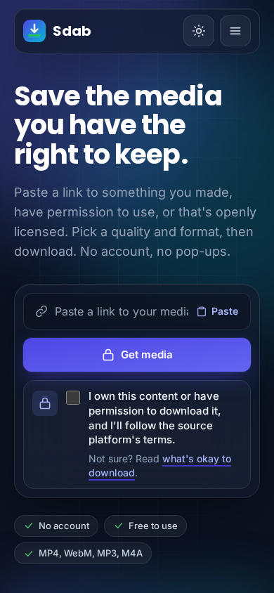
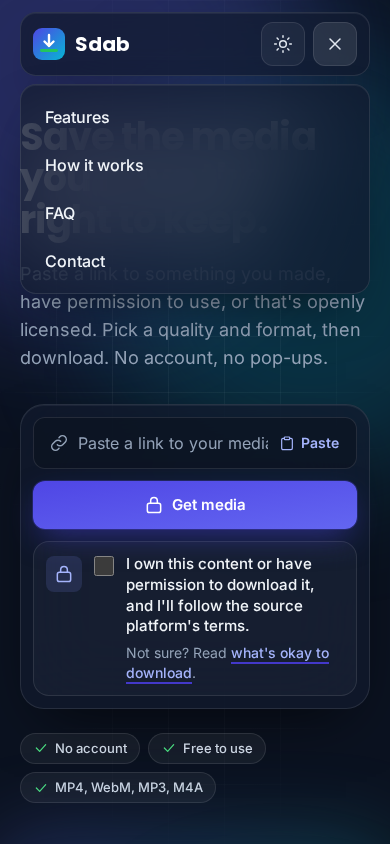
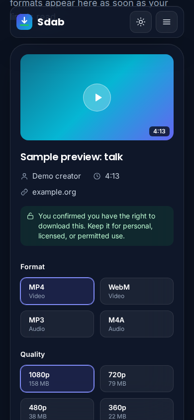
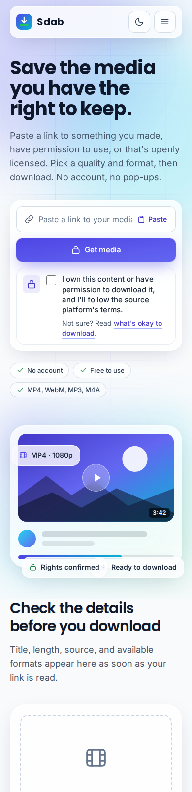
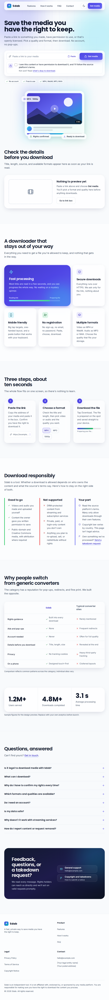
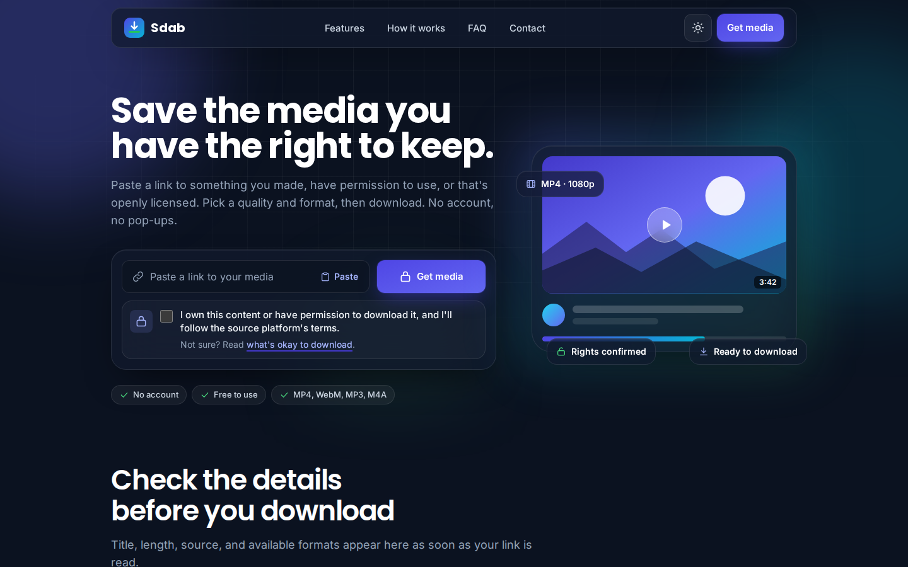
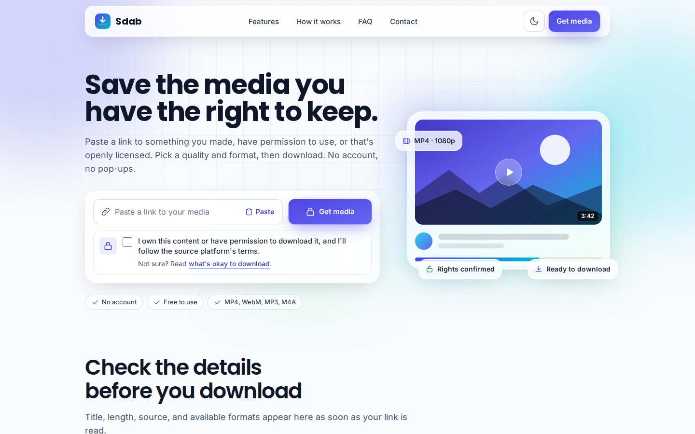
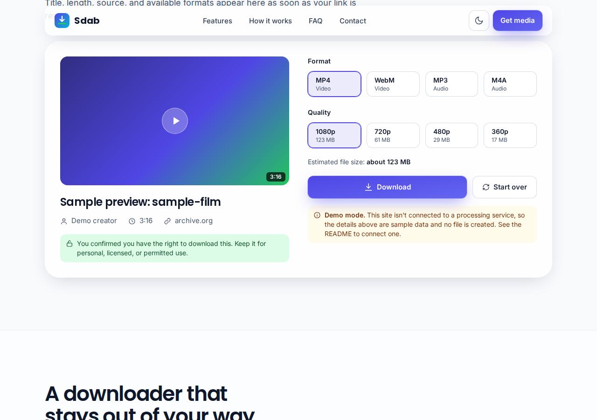

# Sdab: Mobile, Tablet, and Desktop Design Mockups

Covers Deliverable **9** (and the mobile-specific part of Deliverable **6**). Every image below is a real screenshot of the running site (headless Chromium, `prefers-reduced-motion` respected), stored in `docs/screenshots/`. Nothing here is a static comp — each was produced by loading `index.html` at the stated viewport, and the interactive ones by driving the actual form.

---

## 1. Mobile — 390×844 (iPhone 12/13/14 class), dark mode, hero



- Single-column stack: nav → headline → lead paragraph → downloader form → highlight chips.
- Nav collapses the four links and the CTA into a hamburger; only the logo, theme toggle, and menu button remain visible, keeping the bar under 64px tall.
- Every control in the form is full-width and ≥ 44–48px tall; the "Paste" affordance stays inline inside the field rather than becoming a second full-width button, so the field/button relationship reads as one unit.
- Chips wrap to two rows instead of clipping or shrinking illegibly.

## 2. Mobile — navigation menu open



- The menu is an absolutely-positioned overlay anchored to the nav pill (`inset-x-5 top-full`), not a layout push — page content underneath doesn't reflow when it opens.
- Confirmed behaviour: opens on tap, closes on link tap, closes on `Escape`, closes automatically if the viewport is resized past the `md` breakpoint (e.g. rotating a tablet into landscape).

## 3. Mobile — preview "ready" state after a real submission



- Produced by actually filling the URL field, checking the rights box, and submitting on a 390px viewport — this is the live DOM, not a mockup of the intended state.
- Format and quality tiles drop to a 2-column grid (from 4 on desktop) so each tile stays comfortably tappable.
- The green rights-confirmation strip and the format/quality sections stack in a single column below the thumbnail, preserving reading order: what it is → that you confirmed your rights → what to choose → what it'll cost you in storage → the action.

## 4. Mobile — full page scroll (first screen of full-page capture)



Shows the hero-to-preview transition on one continuous mobile page: the illustrated preview mock (used before any real link has been submitted) sits directly under the hero, so first-time visitors see what the result will look like before they've done anything.

## 5. Tablet — 820×1180 (iPad Mini class), full page



- Hero switches to a single column (headline/form above, illustration below) rather than the desktop's side-by-side split — at this width a 7/5 grid would squeeze both halves too tightly to read comfortably.
- The feature "bento" grid steps down from a 6-column asymmetric track to 2 columns; the large "Fast processing" card still spans the full row width so it keeps its visual weight.
- The "how it works" steps and the comparison table both remain legible without horizontal scrolling at this width; the table only becomes scrollable below `md`.

## 6. Desktop — 1440×900, dark and light mode, hero




- Full 12-column hero split (7 text / 5 illustration), four visible nav links, and the CTA button restored to the nav bar.
- Confirms the theme toggle genuinely re-renders every surface (backgrounds, borders, text colors, shadow tone) rather than just swapping a background color — every card, chip, and table row has an explicit `dark:` treatment.

## 7. Desktop — preview "ready" state, light mode



- Two-column layout: media details on the left, format/quality selection and the download action on the right — matches the wireframe's asymmetric-but-related-content pattern rather than stacking unrelated information in two equal columns for its own sake.

## 8. Breakpoint behaviour summary

| Element | Mobile (<640) | Tablet (640–1023) | Desktop (≥1024) |
|---|---|---|---|
| Nav | Hamburger overlay | Hamburger overlay (until `md`=768) | Full link row + CTA |
| Hero | 1 column, form full-width | 1 column, centered max-width | 7/5 split |
| Feature grid | 1 column | 2 columns | 6-col asymmetric (4+2+2+2+2+2) |
| Steps | 1 column | 1 → 3 columns at `md` | 3 columns |
| Format/quality tiles | 2 per row | 4 per row | 2 per row (inside 2-col layout) → 4 at `xl` |
| Comparison table | Horizontal scroll inside container | Fits without scroll | Fits without scroll |
| FAQ | 1 column, heading above | 1 column | 4/8 split |
| Stats | 3 rows, horizontal dividers | 3 columns, vertical dividers | 3 columns, vertical dividers |

## 9. How to regenerate any of these screenshots

```bash
cd sdab
python3 -m http.server 8765 &        # serve over HTTP — fonts/CORS misbehave under file://
```
Then, with Playwright (or any automated browser) installed:
```python
await page.set_viewport_size({"width": 390, "height": 844})   # or 820×1180, 1440×900
await page.goto("http://localhost:8765/index.html")
await page.screenshot(path="out.png", full_page=True)
```
To capture an interactive state (menu open, preview ready), drive the real controls first — `#url-input`, `#rights`, `#fetch-btn`, `#menu-toggle` — exactly as a user would; there is no separate "design mode" to fake these states.
